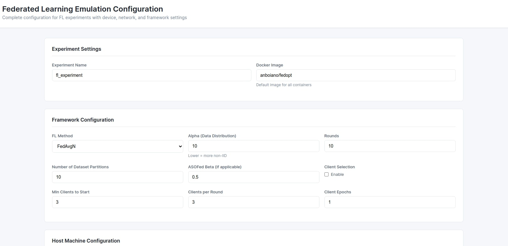

# FederNet

FederNet is a flexible emulation framework for research and development of distributed and federated learning systems. It leverages [Containernet](https://containernet.github.io/) and Docker to deploy and test custom network topologies and device configurations, with a focus on federated learning (FL) protocols and resource-constrained environments.

## Features

- **Custom Emulated Topologies**: Design and emulate complex network topologies using containers.
- **Device & Network Profiling**: Simulate different device types (e.g., edge, IoT, server) and network conditions (bandwidth, delay, jitter, loss).
- **Federated Learning Protocols**: Supports various FL methods, protocols (e.g., gRPC, MQTT), and client selection strategies configurable via YAML.
- **Resource Control**: Fine-grained control of CPU, memory, and device variance for each emulated node.
- **Traffic Capture & Analysis**: Built-in support for capturing traffic (e.g., tcpdump) and analyzing communication (see `Data Analysis/analyze_pcap.ipynb`).
- **Automated Cleanup**: Robust routines to clean up containers and network state after each run.

## Requirements

- Docker
- Python 3.7+
- Containernet (Mininet extension)
- [docker-py](https://pypi.org/project/docker-py/) (`pip install -r requirements.txt`)
- Mininet (see Containernet docs)

## Installation

1. **Install Containernet** (see [Containernet docs](https://containernet.github.io/)).
2. **Clone this repository**:
    ```bash
    git clone https://github.com/antonio-boiano/FederNet.git
    cd FederNet
    ```
3. **Install Python dependencies**:
    ```bash
    pip install -r requirements.txt
    ```

## Usage

### Web-Based Configuration UI

FederNet provides a user-friendly web interface to configure and run experiments without manually editing YAML files.

**Starting the UI:**

You can launch the web interface using either:

1. The quickstart script (recommended):
   ```bash
   bash src/quickstart_script.sh
   ```

2. Or directly with Python:
   ```bash
   python3 src/web_server.py
   ```

Once started, open your browser to `http://localhost:5000` to access the configuration interface.

**UI Features:**
- Complete federated learning framework configuration (FL method, alpha, rounds, client selection, etc.)
- Per-client device and network configuration with presets (Raspberry Pi, Jetson Nano, WiFi, 4G, etc.)
- MQTT broker deployment options (on parameter server or separate container)
- Custom Docker images and commands per node
- Bulk configuration for all clients
- Network monitoring with tcpdump
- Save/load configuration files
- Generate YAML files compatible with `run.py`



After configuring your experiment in the UI, click "Save & Generate YAML" to create a configuration file. The generated YAML can then be executed using:

```bash
sudo python3 src/run.py src/configs/<your_config_file>.yaml
```

### Command-Line Usage

For advanced users or automated workflows, you can run experiments directly with YAML configs:

```bash
sudo python3 src/run.py <config_or_folder>
```

- `<config_or_folder>`: Path to a YAML config file or a directory containing multiple configs.
- Example:
    ```bash
    sudo python3 src/run.py configs/example_experiment.yaml
    ```

### Main scripts

- `src/web_server.py`: Web-based configuration UI for creating experiment configs.
- `src/emulation.py`: Core logic for network and device emulation. Supports CLI arguments for config file, output directory, and interactive mode.
- `src/run.py`: Batch runner for running one or more config files.
- `src/network_debug.py`: Alternative entry point for debugging and network profiling.

## Configuration

Experiments are defined via YAML configuration files.
Typical config keys (see `src/emulation.py` and `src/network_debug.py`):

- `fl_method`: Federated learning algorithm (e.g., fedavg, scaffold).
- `alpha`: Data distribution parameter.
- `clients`: Number of FL clients to emulate.
- `image_name`: Docker image for nodes/clients.
- `protocol`: Communication protocol (e.g., grpc, mqtt).
- `fl_type`: FL variant/type.
- `network_type`: Network topology type or list of types. The full list of predefined networks is found in `resources/network_specs.json`
- `device_type`: Device type(s) for emulated nodes. The full list of predefined devices is found in `resources/device_specs.json`
- `device_variance`: Variability in device profiles (percentage).
- `host_single_core_score`: Host CPU baseline (for profiling). This is the single core score obtained from https://www.geekbench.com/
- `client_selection`: Client selection strategy.

Example (YAML):

```yaml
fl_method: fedavg
alpha: 0.5
clients: 10
image_name: anboiano/federnet
protocol: grpc
network_type: [low,high,high]
device_type: [rpi4, edge, server]
device_variance: 0.2
host_single_core_score: 1079
client_selection: false
```

## Device & Network Profiling

- Device and network profiles are generated using logic in `src/resources/performance.py` and can be extended by user-provided JSON specs.
- Parameters such as CPU, memory, and device frequency can be specified per device or split among clients.

## Output & Analysis

- All experiment outputs (traffic, logs) are stored in dedicated directories named after experiment parameters.
- Use the notebook in `Data Analysis/analyze_pcap.ipynb` for post-experiment traffic/statistics analysis.

## Utilities

- `src/resources/clean_containernet.py`: Ensures a clean environment by stopping and pruning all Docker containers and resetting Mininet/Containernet.
- `src/resources/disable_offload.sh`: Disables network offload features for all interfaces (for packet accuracy in measurements).

## License

This project is licensed under the MIT License. See the [LICENSE](LICENSE) file for details.

---
